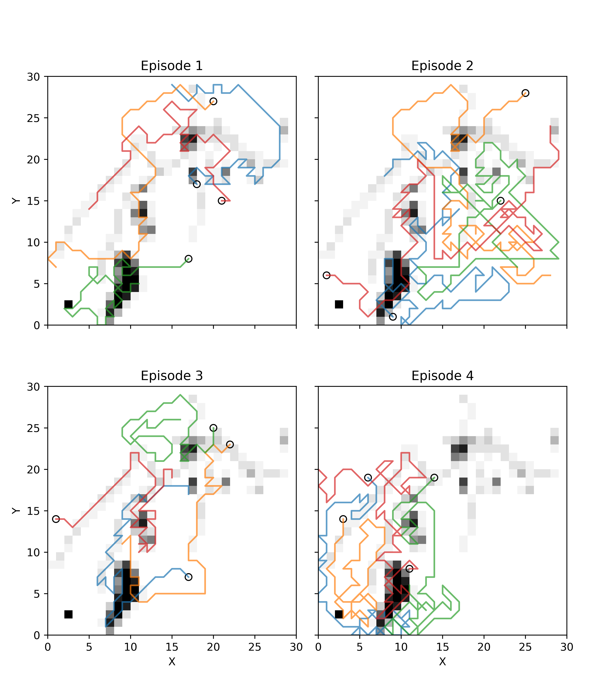

### Abstract

The deployment of autonomous drones in search-and-rescue operations represents
a transformative advancement in disaster response, offering substantial benefits in
scenarios characterized by hazards, time sensitivity, or logistical complexity. This
study introduces a machine learning methodology designed to enable a swarm of
autonomous drones to execute a search-and-rescue mission effectively within a known
environment. By conceptualizing the environment as a grid-based heatmap that
accentuates areas with a higher likelihood of locating survivors, the system trains
agents to prioritize areas of high significance. The primary challenges addressed
include inter-agent coordination, path planning, and task distribution. The proposed
framework ultimately seeks to diminish search duration and personnel needs, thus
enhancing the overall effectiveness and safety of rescue operations.

### Thesis

Read the thesis [here](Thesis.pdf)

